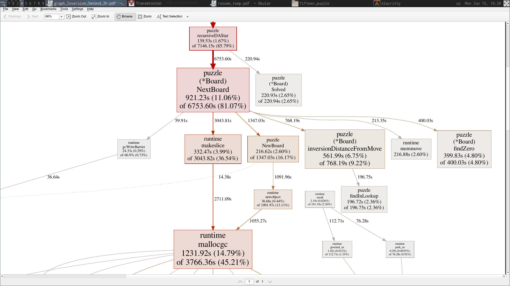

# 15 puzzle

This is an application written in Go which attempts to solve the 15 puzzle with several state-space-search methods

## Implementations

The following algorithms will be used to find a solution:

1. DFS
2. IDFS (Iterative-deepening DFS)
3. A\*
4. IDA\* (Iterative Deepening A\*)

The heuristics implemented were:

1. Max Manhattan Distance (The maximum among the Manhattan distances of all the tiles)
2. Summed Manhattan Distance (The sum of the Manhattan distances of all the tiles)
3. Weighted Manhattan Distance (The Manhattan distances were weighted by the row)
4. Manhattan Distance + Linear Conflict (In short *Combined Manhattan*)
5. Inversion Distance (A heuristic based on the ordering of the tiles)

## Performance

Measurements were made on a laptop running Arch Linux (5.7.2-arch1-1), with an Intel i5-8300H cpu (8 virtual cores) and 8GB of RAM.

### Uninformed algorithms

#### Vanilla DFS

This just fills up RAM. Even with a modest branching factor of at most 4.

#### Iterative-deepening DFS

Memory issues are solved. But it is still very slow and even after 75 minutes of the program running, only a depth of 18 was reached.

### Informed algorithms

#### A\*

This algorithm fills up memory slower than DFS. Nevertheless, it runs out of memory except in the very simple test case.

#### IDA\*

This algorithm fares better than the others in terms of memory usage and speed. However the performance heavily depends on the heuristic used.

Based on measurements made on the input from file **third_input**, the following order was obtained:

    Combined Manhattan (20.746s) < Summed Manhattan (1.250s) < Inversion Distance (0.011s)

All of them found out a solution of 15 moves each.

The performance of *Combined Manhattan* is not fully reflected in the above number. While the other two heuristic values are calculated in constant time from the heuristic value of the previous node, I haven't found a way to do so for the Linear Conflict. Hence, the entire heuristic is recalculated from scratch for each node.

## Problems

Even with the best heuristic (Inversion distance) and IDA\*, not all legal initial positions are being solved. The harder initial states seem to take forever to solve.

To this end, the program was let to run for 2 hours on the input from file **second_input** and a CPU profile was run using the `pprof` tool built into the Go test system. The call graph was saved in *graph_Inversion_Second_2h.pdf*. A screenshot of the most significant part of the graph is as follows:

While 85.79% of the total time was spent running IDA\* (the rest is consumed by the profiling framework), 45.21% time was spent behind `mallocgc`, ie, 52.7% of the time running IDA* was spent by `mallocgc`.
`mallocgc` is Go's implementation of the C `malloc` function, and performs roughly the same tasks as it does. So evidently, if a large number of nodes have to be generated and examined by the IDA\*, memory allocation becomes the bottleneck.

## Improvements

The only way around generating lot of nodes is being able to prune them off early. For that, a better heuristic is required which will provide a tighter lower bound. There is a heuristic in literature called the *Walking distance* heuristic, coined by Ken'ichiro Takahashi. It is supposed to perform better than the Inversion distance heuristic. Also, *pattern databases* can be used to generate better bounds.
